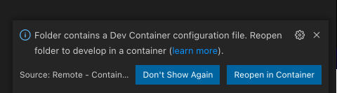
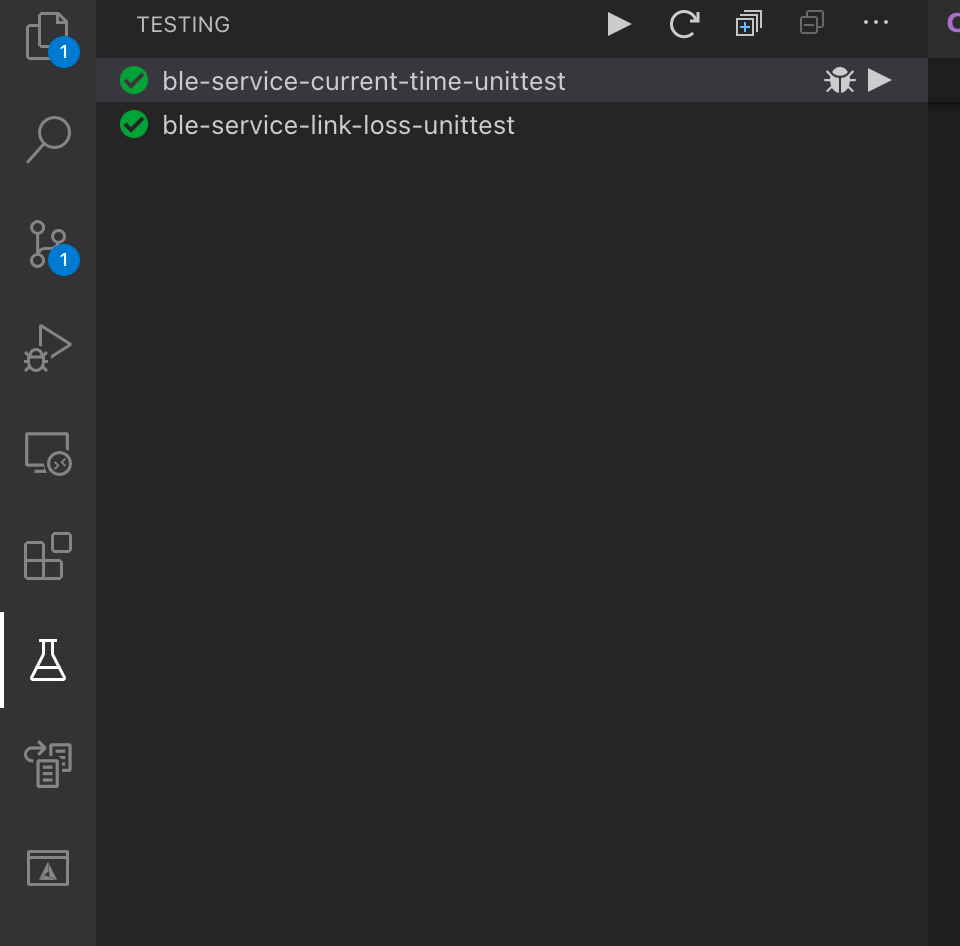

# Development

New services, enhancement and bug fixes are welcomed. To contribute to this 
repository you should set up a development environment. 

## Getting started 

### Setup

To facilitate the development experience, a Visual studio code configuration is 
available out of the box as well as a ready to use docker image. 

First you need to download and install [VSCode](https://code.visualstudio.com/)
and [docker](https://www.docker.com/products/docker-desktop). 

Start docker then start VSCode and install the [Remote - Containers](https://marketplace.visualstudio.com/items?itemName=ms-vscode-remote.remote-containers) extension. 

Open the local version of this repository VSCode and VSCode will propose you to 
reopen the folder in a container. 

If you miss VSCode toast, you can open the 
[command palette](https://code.visualstudio.com/docs/getstarted/userinterface#_command-palette)
and search for `Open folder in container...` ([reference](https://code.visualstudio.com/docs/remote/containers#_quick-start-open-an-existing-folder-in-a-container))

When the container is started, it will download the development image of this repository 
and set it up. Once ready open the command palette > `Run Task` > `Bootstrap`. 
This action will setup the rest of the environment specific to the repository.

That's it you're all set to develop and debug new and exciting services!

### Commands

All the commands you need are accessible through the command palette:
- Cmake configuration: > `Cmake: Configure`
- Build: > `Cmake: Build`
- Execute test: > `Cmake: Run Test` 

### Debug tests

To debug a test, open the test panel on the left and click on the bug icon of the test you want to debug.

### Troubleshooting

- Autocompletion: The autocompletion engine takes a significant amount of time to 
start. When it is ready, the database icon at the bottom of the IDE should disappear. 
- Speed: I/O can be slow when docker is run on Window or MacOS systems. You can 
clone this repository in a docker volume using the command [`Clone Repository in Container Volume`](https://code.visualstudio.com/docs/remote/containers#_quick-start-open-a-git-repository-or-github-pr-in-an-isolated-container-volume) .

## Bare Requirements 

It is possible to develop services in your native environment and IDE of your 
choice (including VSCode!). 

The following softwares are required to build and run the unit tests from this 
repository: 
- CMake
- Git
- An host toolchain 
- Ninja

From an environment standpoint, an `mbed-os` folder should be present in the 
`tests` folder. It can be a symbolic link to a local Mbed OS version or a plain 
clone. Running the command `bootstrap.sh` will ensure Mbed OS is available in the 
environemnt. 
