# FOTA Service Overview

The FOTA (**F**irmware **O**ver **T**he **A**ir) service facilitates transfer of firmware updates over BLE using GATT Characteristics.

The FOTA service has been designed to allow for extensions to optimize transfer speeds and enable advanced update features. These advanced features are not included in the base implementation in order to maximize compatibility with constrained targets.

## Terminology

FOTA stands for firmware over the air
The **FOTA Target** is the device hosting the FOTA Service
The **FOTA Client** is the device acting as the client of the FOTA Service, ie: the peer sending the firmware.

# FOTA Service Structure

The structure of the FOTA Service is below:

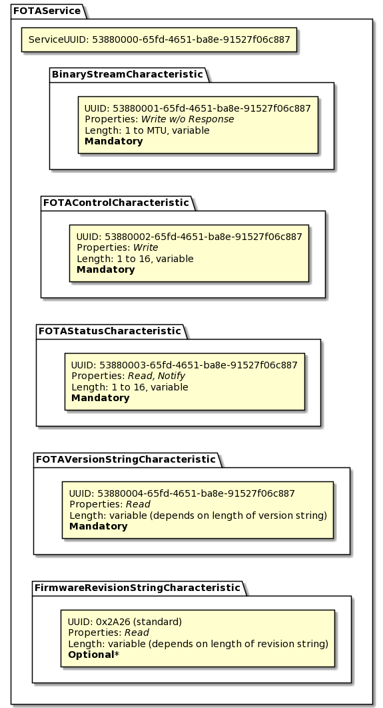

There are three mandatory characteristics and one optional characteristic.

## Binary Stream Characteristic

The Binary Stream Characteristic (**BSC**) is the primary characteristic used to transfer firmware binary information over BLE. The maximum length of this characteristic is limited by the MTU of the connection. To maximize transfer speeds, this characteristic can only be written to using the **write without response** operation. Since firmware transfers **must** be lossless and retain the original data sequence, the FOTA service implements an application-level error correction scheme in the event of a packet loss. Corrupt data detection (ie: CRC checks) are implemented in lower layers of the BLE protocol and therefore are not required in the application layer.

The packet structure of the the FOTA service is simple. The first byte of each write to the BSC must be a sequential, 8-bit **fragment ID**. The fragment ID must be incremented for each write to the BSC. The fragment ID must roll over from 255 to 0:

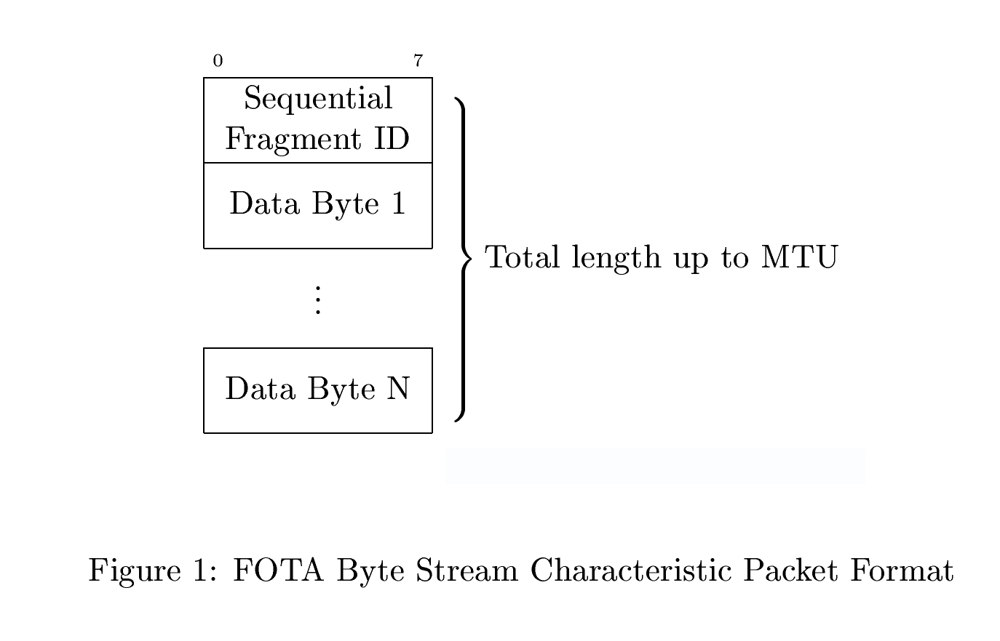

Subsequent bytes written to the BSC after the fragment ID are considered binary firmware data.

Writes to the BSC may be ignored if the FOTA target is busy (eg: waiting for flash operations to finish) and unable to buffer any more data. This busy status will be communicated to the FOTA client using the FOTA Status Characteristic described later.

Out-of-sequence writes to the BSC will be ignored and trigger a lost-synchronization response through the FOTA Status Characteristic. This implements the previously-mentioned error correction scheme. This mechanism allows for lost packets to be retransmitted and to reestablish synchronization between the FOTA target and client.

## FOTA Control Characteristic

The FOTA Control Characteristic allows the FOTA client to control the FOTA session. This characteristic has a variable length with a maximum length limited by the MTU of the connection. This allows the application to add more advanced commands by simply defining a new command operation code (op-code) and packet structure:

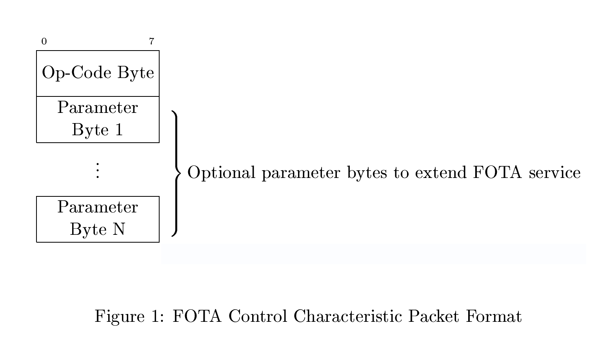

This characteristic only supports the **write** (with response) operation. In accordance with Bluetooth Core specification V5.2, Vol 3, Part F, Table 3.4 (Error Codes), ATT Error Codes between 0x80 and 0x9F are reserved for use by the application. Some of these error codes are defined by the standard FOTA service implementation. Unreserved ATT Error Codes may be defined by user application extensions as necessary.

The application ATT error codes defined/reserved by the FOTA Service are tabulated below:

| ATT Error Code   | Name                                            | Description                                      |
|------------------|-------------------------------------------------|--------------------------------------------------|
| 0x0190           | `AUTH_CALLBACK_REPLY_ATTERR_APP_BUSY`           | Application is busy                              |
| 0x0191           | `AUTH_CALLBACK_REPLY_ATTERR_UNSUPPORTED_OPCODE` | Op Code is unsupported                           |
| 0x0192           | `AUTH_CALLBACK_REPLY_ATTERR_HW_INHIBIT`         | Hardware inhibited processing the op code        |
| 0x0193           | `AUTH_CALLBACK_REPLY_ATTERR_LOW_BATTERY`        | Low battery inhibited processing the op code     |
| 0x0194           | `AUTH_CALLBACK_REPLY_ATTERR_OUT_OF_SYNC`        | Transfer is out of sync                          |
| 0x0195 to 0x019F | Reserved                                        | Reserved for future use by the base FOTA service |

Any unhandled op-codes will trigger a write response error code of `AUTH_CALLBACK_REPLY_ATTERR_UNSUPPORTED_OPCODE`.

There are multiple response error codes that may be used by the user's `EventHandler` implementation to reject a FOTA session. These include `AUTH_CALLBACK_REPLY_ATTERR_LOW_BATTERY`, which indicates the FOTA session was rejected due to a low battery as well as `AUTH_CALLBACK_REPLY_ATTERR_HW_INHIBIT`, which indicates the FOTA session was rejected by some other inhibiting hardware state (eg: device in use).

Most standard operations use only 1 byte and have no parameters. The first byte written to the FOTA Control Characteristic is the command op-code. 

Several standard op-codes are defined and support for them is mandatory. The application is free to use any unreserved op-codes to extend the available FOTA features.

The standard op-codes are:

| Op Code   | Name        | Description                                     |
|-----------|-------------|-------------------------------------------------|
| 0x00      | No op       | No operation                                    |
| 0x01      | FOTA Start  | Initiate a FOTA update session                  |
| 0x02      | FOTA Stop   | Abort a FOTA update session                     |
| 0x03      | FOTA Commit | End a FOTA update session and commit the update |
| 0x04-0x40 | Reserved    | Reserved for future use by base FOTA service    |

An example of an extension op-code that could be added by the application is the ability to select from multiple "memory slots" where the binary stream can be written to.

Each of the standard op-codes is discussed in more detail in the following "Sequence Diagrams" section.

## FOTA Status Characteristic

The FOTA Status Characteristic communicates status and op-code response information from the FOTA target to the FOTA client. This characteristic supports read and notify operations. The FOTA client should enable notifications from this characteristic to ensure status updates and error conditions are communicated as quickly as possible.

Similar to the FOTA Control Characteristic, the FOTA Status Characteristic has a variable length limited by the MTU of the connection. Again, this is to allow for user applications to define extensions to the FOTA service.

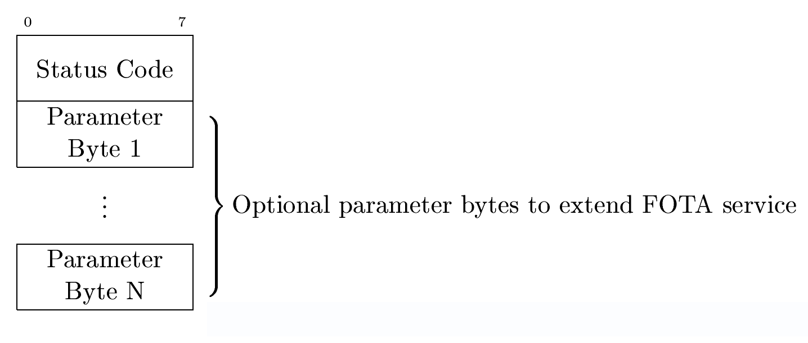

The base FOTA service implementation defines standard status codes that all FOTA clients should recognize. The application is free to use any unreserved status codes to extend the avaialable FOTA features.

The standard status codes are:

| Status Code | Name                 | Description                                      |
|-------------|----------------------|--------------------------------------------------|
| 0x00        | OK                   | Indicates a neutral ready state                  |
| 0x01        | UPDATE SUCCESS       | Update process was successful                    |
| 0x02        | XOFF                 | Software flow control, pause writing to the BSC  |
| 0x03        | XON                  | Software flow control, resume writing to the BSC |
| 0x04        | SYNC LOST            | Out of sync fragment ID received                 |
| 0x05        | UNSPECIFIED ERROR    | Unspecified error                                |
| 0x06        | VALIDATION FAILURE   | Failed to validate firmware update candidate     |
| 0x07        | INSTALLATION FAILURE | Failed to install firmware update candidate      |
| 0x08        | OUT OF MEMORY        | The underlying memory is full                    |
| 0x09        | MEMORY ERROR         | Error writing to underlying memory device        |
| 0x0A        | HARDWARE ERROR       | Hardware failure                                 |
| 0x0B        | NO FOTA SESSION      | No FOTA session started                          |
| 0x0B-0x40   | Reserved             | Reserved for future use by base FOTA service     |

### Software Flow Control

If the FOTA target is unable to accept any more binary data during the FOTA session, the FOTA target will write the `XOFF` status code to the FOTA Status Characteristic. Any writes to the BSC after the `XOFF` status code has been sent will be ignored and the FOTA target will subsequently write `XOFF` to the FOTA Status Characteristic again. This is to handle the case where the FOTA client missed a previous `XOFF` status notification.

When the FOTA target is again able to accept new binary data, the FOTA target will write the `XON` status code to the FOTA Status Characteristic. 

### Resynchronization

Each write to the BSC must begin with the sequential 8-bit fragment ID of the transfer. Since write-without-response is used, it is possible for a BSC packet to be dropped. To detect this, the FOTA target caches the last fragment ID it received successfully. If the next fragment ID received is not this cached value + 1 (or 0 in the case of a fragment ID rollover from 255), the FOTA target will write the `SYNC_LOST` status code to the FOTA Status Characteristic. The FOTA target will also write the expected fragment ID as the second byte in the FOTA Status Characteristic.

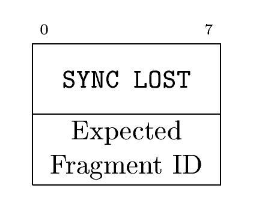

The FOTA client must recognize this condition and correct it by returning to the appropriate location in the firmware binary being transferred  (as indicated by the expected fragment ID sent by the FOTA target) and resume transmission from there.

If the FOTA client misses a `SYNC_LOST` notification, the FOTA target will issue another `SYNC_LOST` notification upon reception of the next (out of sync) packet written to the BSC. A possible edge case in this scenario is if the FOTA client finishes writing the firmware binary without successfully receiving a `SYNC_LOST` notification.

If the FOTA client attempts to issue a `FOTA Commit` command while the FOTA target is in an out-of-sync state, the FOTA target will respond with the ATT error code `AUTH_CALLBACK_REPLY_ATTERR_OUT_OF_SYNC` and issue another `SYNC_LOST` notification on the FOTA Status Characteristic.

### Communicating Update Success Status

The FOTA service does not place any requirements on the FOTA target application to communicate update success status to the FOTA client. However, the FOTA service *does* have provisions to communicate update success status.

See the "Ending a FOTA session" section below for more information on communicating update success.

## Firmware Revision String Characteristic

The FOTA service specification includes an optional* Firmware Revision String Characteristic. This characteristic is a standard, BTSIG-specified BLE GATT Characteristic with a 16-bit UUID of `0x2A26`. This characteristic is **only optional** if:

- There is only **one** FOTA service instance in the device's GATT Profile **AND**
- The device's GATT profile has **one** instance of the standard Device Information Service (UUID: 0x180A) that includes **one** instance of the Firmware Revision String Characteristic (UUID: 0x2A26), and this characteristic is populated with the revision string of the firmware associated with this FOTA service.

The intent behind this is that the firmware revision associated with a FOTA service is always available. If there is any ambiguity (eg: the GATT profile has two Firmware Revision String Characteristics in its structure), the FOTA service Firmware Revision String Characteristic is **mandatory**.

Additionally, there is a conditionally optional Characteristic User Description Descriptor (CUDD, UUID: 0x2901). This descriptor is optional **if and only if** there is only one Firmware Revision String Characteristic available on the server (and therefore only one FOTA service instance as well).

If there are multiple FOTA services or multiple Firmware Revision String characteristics, this descriptor is **mandatory**.

The contents of this descriptor should be a string that describes the module that this FOTA service instance updates the firmware of, eg: "cellular modem", "coprocessor", etc.

# Sequence Diagrams

The following sections show sequence diagrams of possible situations during a FOTA session.

## Starting a FOTA Session

Writing the FOTA Start command to the Control characteristic starts a FOTA update session. This allows the user's application to perform any necessary preparations before beginning an update session. eg: shutdown other subsystems, close files, update the UI to indicate the update to the device user, erase flash memory in preparation to receive the update binary, etc.

The FOTA target may choose to issue an immediate `XOFF` status notification to pause binary transmission until all preparations have been completed. Otherwise, the FOTA target, if ready, will issue an `OK` status notification.

In the prior case, the FOTA client should not commence binary transmission until the FOTA target has issued an `XON` status notification. See the flow control section for more information on software flow control.

This section shows two possible cases for starting a FOTA Session: **immediate start** and **delayed start**

The application is responsible for implementing the necessary logic in the `FOTAService::EventHandler` to perform either FOTA start types, as required.

Each of the following sequence diagrams assumes the following preconditions:

- There is an existing BLE connection between the FOTA client and FOTA target
- Depending on how the FOTA service is configured with regard to security, link security may be established as required (ie: paired/bonded, link is encrypted).
- A FOTA session has not been started

### Immediate Start

To start a FOTA Session, the FOTA client must write the FOTA Start Op-code to the FOTA Control Characteristic. In the immediate start case, the FOTA target replies immediately with a status notification of **either** `OK` or `XON`. The FOTA client should interperet either of these as a positive response and proceed with the FOTA session immediately:

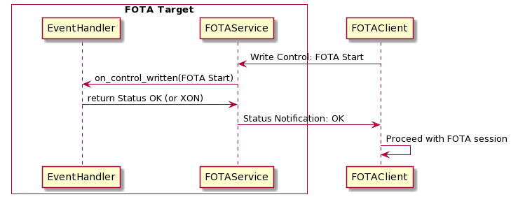

### Delayed Start

The delayed start allows a FOTA target to perform any required preparations before a FOTA session begins. Preparations may include actions such as:
- indicate the FOTA session start to the device user through UI or LEDs
- erase the update memory

**Note:** If the preparations can block for a long period of time (eg: erasing an entire SPI flash chip), they should be either:
- Run on a separate `Thread`/`EventQueue`
- Or, in the baremetal (RTOS-less) case, the preparations should be broken up into shorter operations (eg: erase a single sector of the external SPI flash)

If the preparations block for a long period of time, the BLE connection could be terminated due to timeout. Therefore, preprations should periodically allow BLE events to be processed to ensure the connection does not timeout.

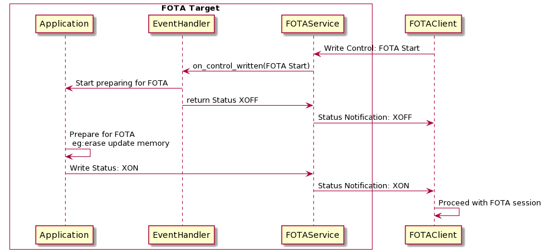

### False Start

If the FOTA client attempts to write the BSC before starting a FOTA session, the FOTA client will issue a status notification with the status code: `NO_FOTA_SESSION`:

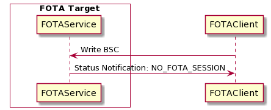

This is referred to as a "FOTA False Start."

### Not Ready

If the FOTA client is in the process of performing a critical function it may reject a FOTA start call with the `AUTH_CALLBACK_REPLY_ATTERR_APP_BUSY` write response.

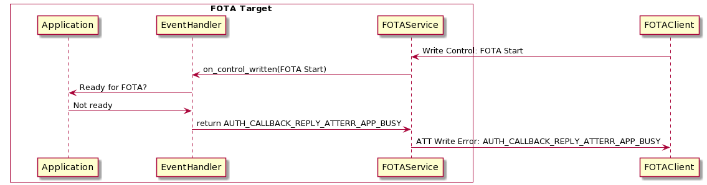

## FOTA Session

During a FOTA session, the FOTA client may write firmware binary information to the BSC with a packet format outlined in the previous "Binary Stream Characteristic" section.

Each of the following sequence diagrams assumes the following preconditions: A FOTA session **has** been started

### Normal FOTA

During a normal FOTA session without any packet loss, the following sequence diagrams apply.

Start of FOTA session:

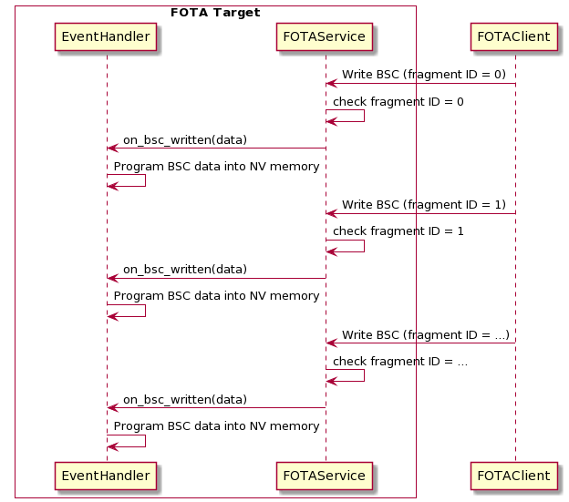

After a number of packets, the fragment ID will roll over:

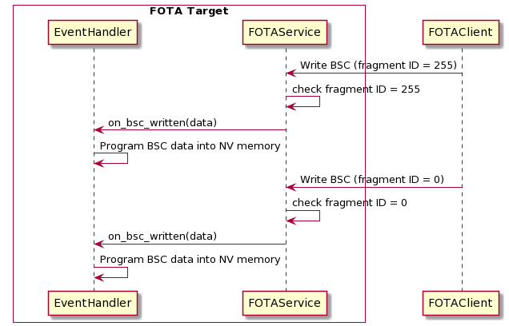

### Flow Control

Depending on the application, processing the BSC data may take longer than the time between received packets. In this case, the FOTA target may choose to buffer the packets. If the packet buffer overflows, data may be lost. To prevent this condition, the FOTA service implements software flow control through the Status characteristic, as described previously. Flow control during a FOTA session is described by the below sequence diagram:

As mentioned above, writes to the BSC after an XOFF status has been set will be ignored and an XOFF Status Notification shall be issued each time the BSC is written in this state:

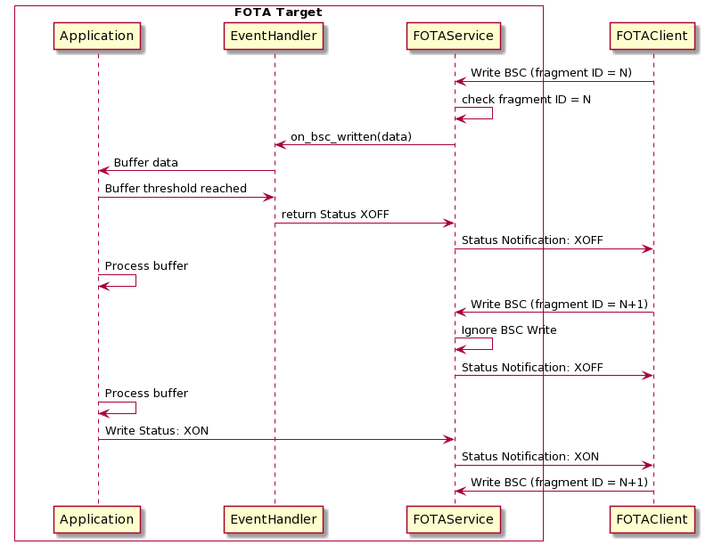

It is recommended that the FOTA client periodically attempt to write the next packet to the BSC and listen for a negative `XOFF` status notification. This is to handle the case where the FOTA client missed a previous `XON` status notification.

The FOTA client may also read the Status characteristic to detect the `XON` state in case the `XON` notification was missed. Also note that it is possible for the Status characteristic to change from `XON/XOFF` to any other status (eg: `MEMORY ERROR`) even while flow control is active, so it is recommended that the FOTA client cache the flow control state. The FOTA target also caches the flow control state and will renotify the FOTA client during a subsequent BSC write (if flow is paused) as described above.

### Sync Lost Event

If a packet is lost during a FOTA session, the fragment ID expected by the FOTA target will not match the fragment ID of the next packet received from the FOTA client. As described earlier, the FOTA target will notify the `SYNC_LOST` state with the expected fragment ID as an additional parameter. The FOTA client must return to the packet matching the expected fragment ID and begin retransmission from there:

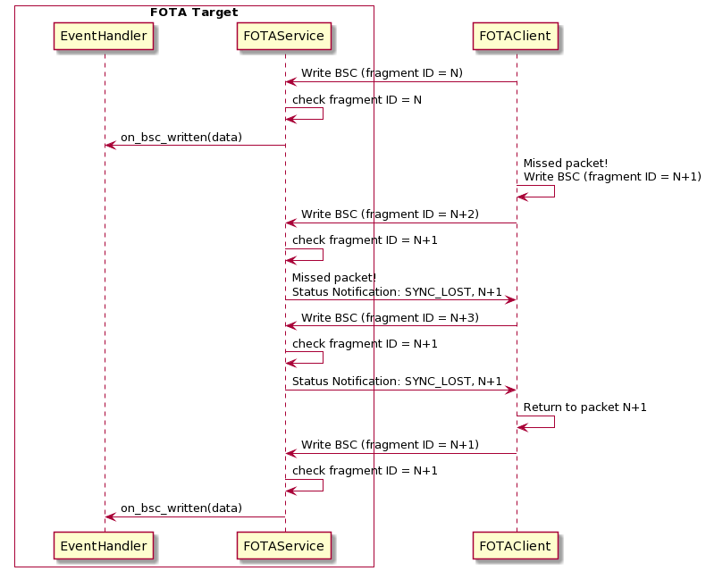

## Ending a FOTA Session

### FOTA Commit

Once the firmware binary has been fully transferred, the FOTA client shall write the `FOTA Commit` op-code to the Control characteristic.. This command initiates validation and installation of the transferred firmware binary on the FOTA target.

If the FOTA client attempts to issue a `FOTA Commit` command while the FOTA target is in an out-of-sync state, the FOTA target will respond with the ATT error code `AUTH_CALLBACK_REPLY_ATTERR_OUT_OF_SYNC` and issue another `SYNC_LOST` notification on the FOTA Status Characteristic.

The details of the FOTA Commit operation are not defined by the FOTA Service specification. Common operations performed during a FOTA Commit operation may include:

- Validating the transferred binary using a digital signature scheme
- Gracefully shutting down application subsystems in preparation for a device reset
- Initiating a BLE disconnection

### Communicating Update Success: Deferred Validation

In some cases, digital signature verification and binary installation are performed by a bootloader *and not* the application. Therefore, the success of the update may not be available during the same BLE connection that a FOTA session took place. ie: the FOTA target may have to reset itself so the bootloader can perform verification and installation of the update. This is referred to as **deferred update validation**.

A deferred update validation may follow a process similar to the following:

The sequence diagram is similar for the case where a firmware update candidate fails to be validated.

### Communicating Update Success: Immediate Validation

If the update success status *is* available during the same BLE connection that a FOTA session took place, this is referred to as **immediate update validation**.

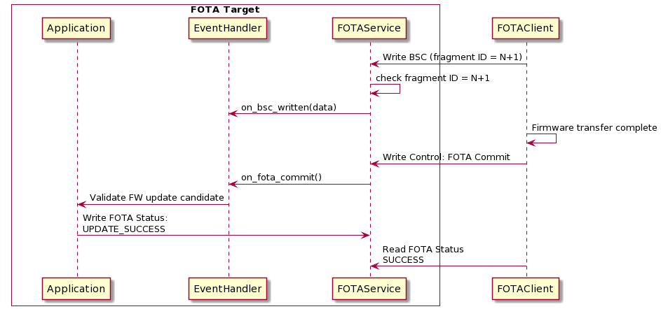

The sequence diagram is similar for the case where a firmware update candidate fails to be validated.

Obviously, this scheme simplifies the FOTA client logic, but it also introduces a depedency that the application has the means to validate firmware updates itself (ie: access to signing keys and other sensitive information).

### FOTA Abort

The FOTA Stop command is used to immediately terminate (ie: abort) a FOTA session. It is application-specific whether this removes the incomplete binary from memory. This command will reset the internal state of the FOTA service. The transferred firmware binary will not be installed or validated.

# Documentation Tools

Tools used to generate this documentation include PlantUML, LaTeX, and [tablesgenerator.com](https://www.tablesgenerator.com/markdown_tables#).

You can edit the tables more easily by copying them into the above Markdown tables generator.
