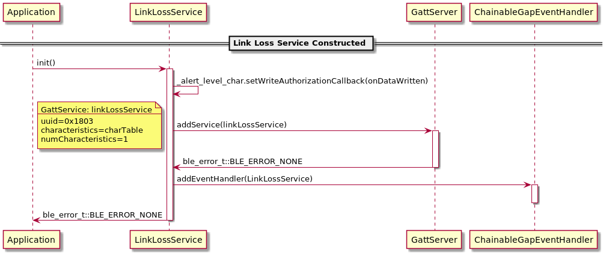
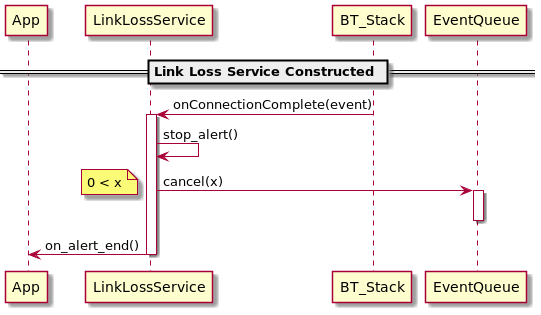
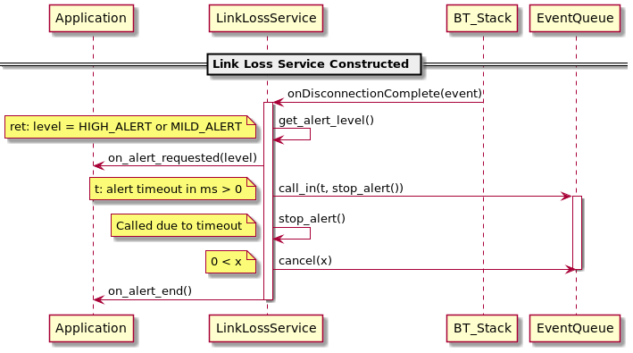
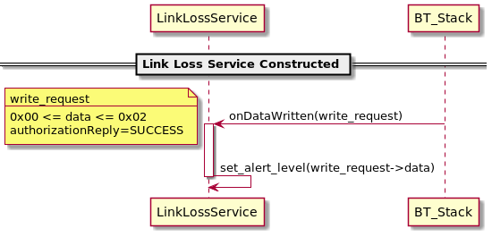
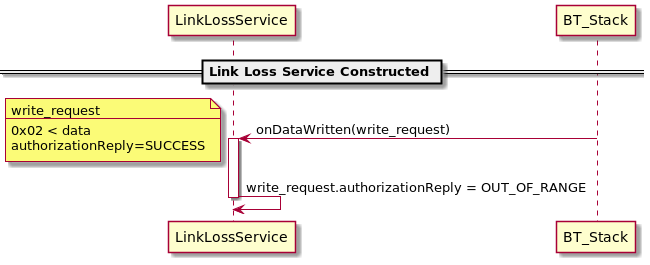
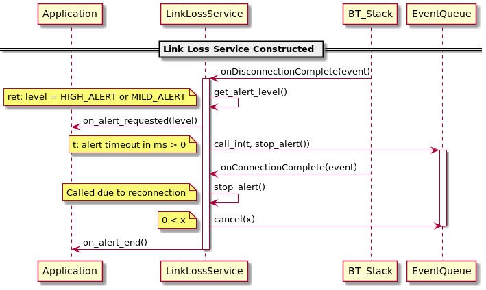

# plantuml
This directory contains UML sequence diagrams for the Link Loss Service (LLS). 
The [PlantUML](https://plantuml.com/) files are located in the `source` folder.
These can be copied into the [Online Server](http://www.plantuml.com/plantuml) or opened in any IDE that supports PlantUML.
The diagrams can be located in PNG format under the `img` folder, but are embedded in this README for ease of viewing.

## Purpose
The purpose is to illustrate the main sequences present in an application that uses a Link Loss Service, such as the [BLE_GattServer_ExperimentalServices](https://github.com/ARMmbed/mbed-os-example-ble/tree/master/BLE_GattServer_ExperimentalServices) example.

Sequence diagrams can aid in the development of unit tests. 
The tests in `tests/UNITTESTS/LinkLoss` are a reflection of the sequence diagrams provided here. 
It is recommended to create sequence diagrams before writing unit tests for new services.

## Sequence Diagrams

**Fig. 1. Normal Initialization**

**Fig. 2. Normal Connection**

**Fig. 3. Normal Disconnection**

**Fig. 4. Normal Write Request**

**Fig. 5. Invalid Write Request**

**Fig. 6. Disconnection Reconnection**

